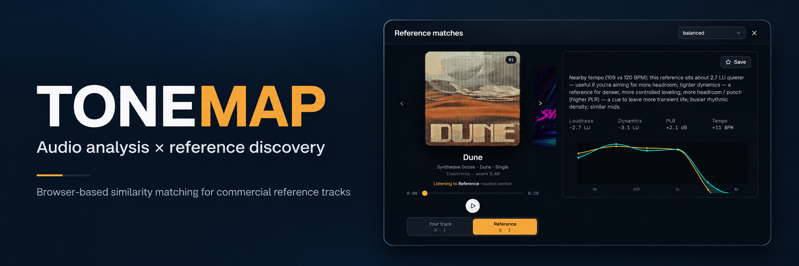
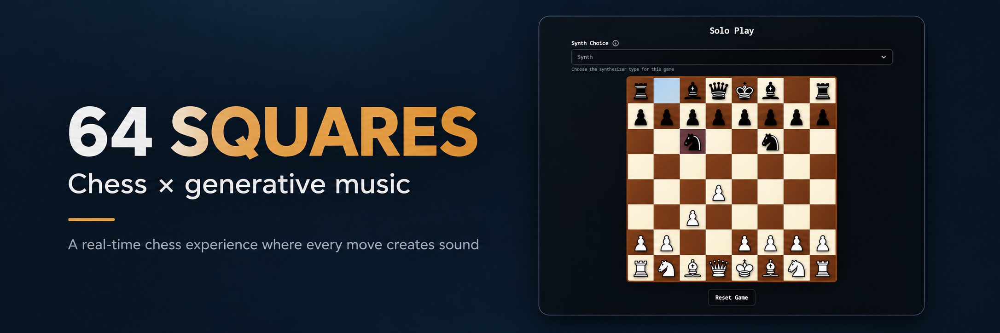
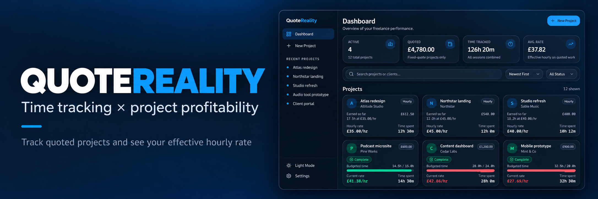
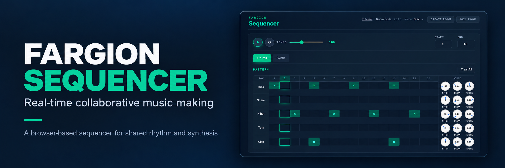

# Giacomo Fargion

### Full-stack developer building creative software, audio tools and real-time web applications.

I work mainly with **TypeScript, React and Next.js**, with particular interests in audio technology, real-time systems and thoughtful user interfaces.

My background is in electronic music and sound design, which often finds its way into the software I build.

[Portfolio](https://giacomofargion.com) · [Tonemap](https://tonemap.online) · [64 Squares](https://64squares.xyz)

---

## Selected work

### Tonemap

Find commercial reference tracks that match an uploaded mix using browser-based audio analysis, genre tagging and similarity ranking.

**Next.js · TypeScript · Essentia.js · Discogs-EffNet · Neon · Clerk · Stripe · Cloudflare R2**

[Live site →](https://tonemap.online) · [Repository →](https://github.com/giacomofargion/referencer)

 

### 64 Squares

A real-time multiplayer chess application where every move generates sound, turning the game into an evolving musical composition.

**Next.js · TypeScript · Supabase Realtime · Tone.js · Zustand · chess.js**

[Live site →](https://64squares.xyz) · [Repository →](https://github.com/giacomofargion/64-squares)

 

### QuoteReality

A full-stack time tracker for fixed-price freelance projects that shows how quoted work translates into an effective hourly rate.

**Next.js · TypeScript · Neon PostgreSQL · Clerk · Zustand · React Hook Form · Zod**

[Repository →](https://github.com/giacomofargion/quote-tracker)

 

### Fargion Sequencer

A browser-based collaborative step sequencer with shared rooms, live controls, chat and recording.

**Next.js · TypeScript · Supabase Realtime · Tone.js**

[Live site →](https://fargion-sequencer.vercel.app/) · [Repository →](https://github.com/giacomofargion/Sequencer)

---

## Tech

**Frontend** — TypeScript, JavaScript, React, Next.js, Tailwind CSS  
**Backend & data** — PostgreSQL, Supabase, Neon, REST APIs  
**Creative & realtime** — Tone.js, Essentia.js, Three.js, GSAP, Supabase Realtime  
**Tools** — Git, GitHub, Vercel, Playwright  
**Currently learning** — AWS

---

## Background

Before moving into software development, I studied electronic music at the **Guildhall School of Music & Drama** and worked across composition, production and audio engineering.

That background continues to shape the software I build, particularly projects involving **audio, interaction, real-time systems and creative tools**.
